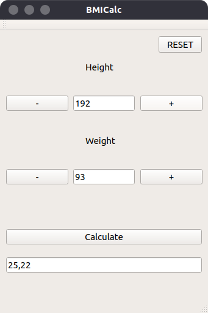
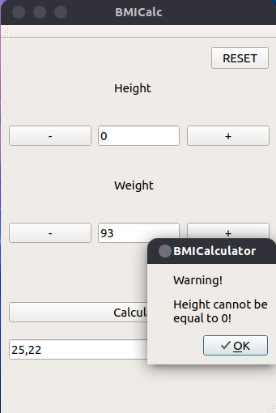
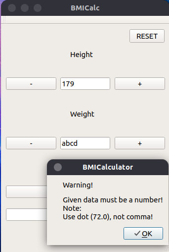

# BMICalculator

BMICalculator is a desktop application, which calculates BMI from given height(cm) and weight(kg).

## Installation

Use the [qmake](https://doc.qt.io/qt-5/qmake-manual.html) to install BMICalculator.

```bash
qmake BMICalculator.pro
make
```

## Usage

```bash
./BMICalculator
```

## License
[MIT](https://choosealicense.com/licenses/mit/)

## Author

Mateusz Rzeczyca

mateuszrzeczyca17@gmail.com

## Screenshots

 
 
 

